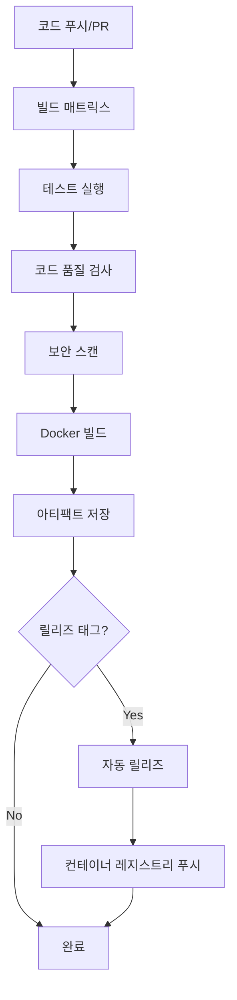

# CI/CD 향상방안 가이드

## 개요

이 문서는 `unilink` 프로젝트의 CI/CD 파이프라인 향상방안을 설명합니다. 현재 프로젝트에는 CI/CD 설정이 없었으므로, 종합적인 자동화 파이프라인을 구축했습니다.

## 구현된 CI/CD 구성요소

### 1. GitHub Actions 워크플로우

#### 1.1 메인 CI 파이프라인 (`.github/workflows/ci.yml`)

**주요 기능:**
- **멀티 플랫폼 빌드**: Ubuntu 20.04/22.04, macOS 12/13
- **멀티 컴파일러 지원**: GCC, Clang
- **빌드 구성**: Minimal Build, Full Build
- **자동 테스트**: 132개 테스트 케이스 자동 실행
- **문서 생성**: Doxygen을 통한 API 문서 자동 생성
- **아티팩트 관리**: 빌드 결과물 자동 저장

**워크플로우 단계:**
1. **빌드 및 테스트 매트릭스**: 다양한 OS/컴파일러 조합
2. **메모리 안전성 테스트**: AddressSanitizer, LeakSanitizer
3. **성능 테스트**: 벤치마크 및 성능 검증
4. **코드 품질 검사**: clang-format, clang-tidy, cppcheck
5. **Docker 빌드 및 테스트**: 컨테이너 환경 검증
6. **보안 스캔**: Trivy를 통한 취약점 검사
7. **릴리즈 자동화**: 태그 기반 자동 릴리즈

#### 1.2 Docker 워크플로우 (`.github/workflows/docker.yml`)

**주요 기능:**
- **멀티 아키텍처 빌드**: linux/amd64, linux/arm64
- **자동 푸시**: GitHub Container Registry
- **캐시 최적화**: GitHub Actions 캐시 활용
- **보안 스캔**: Trivy 취약점 검사

#### 1.3 CodeQL 보안 분석 (`.github/workflows/codeql.yml`)

**주요 기능:**
- **정적 분석**: C++ 코드 보안 취약점 검사
- **정기 스캔**: 주간 자동 스캔
- **PR 기반 스캔**: 모든 PR에 대한 보안 검사

### 2. Docker 최적화

#### 2.1 멀티스테이지 빌드

**Builder Stage:**
- 모든 빌드 도구 포함
- 테스트 실행
- 문서 생성

**Production Stage:**
- 최소한의 런타임 의존성만 포함
- 보안을 위한 non-root 사용자
- 최적화된 이미지 크기

#### 2.2 Docker Compose 설정

**개발 환경:**
- 실시간 코드 변경 반영
- 디버그 빌드 설정
- 테스트 환경 분리

**운영 환경:**
- 프로덕션 최적화
- 자동 재시작 설정
- 네트워크 격리

### 3. 의존성 관리

#### 3.1 Dependabot 설정

**자동 업데이트:**
- GitHub Actions 업데이트
- Docker 이미지 업데이트
- 주간 자동 PR 생성

## CI/CD 파이프라인 흐름



## 주요 향상사항

### 1. 자동화 수준 향상

**Before:**
- 수동 빌드 및 테스트
- CI/CD 파이프라인 없음
- 릴리즈 프로세스 수동

**After:**
- 완전 자동화된 CI/CD 파이프라인
- 멀티 플랫폼 자동 테스트
- 자동 릴리즈 및 배포

### 2. 품질 보증 강화

**테스트 커버리지:**
- 132개 테스트 케이스 자동 실행
- 메모리 안전성 테스트
- 성능 벤치마크
- 멀티 플랫폼 검증

**코드 품질:**
- 자동 포맷팅 검사
- 정적 분석 도구
- 보안 취약점 스캔

### 3. 개발 효율성 향상

**빠른 피드백:**
- PR당 평균 5-10분 내 결과
- 병렬 테스트 실행
- 캐시를 통한 빌드 최적화

**개발 환경:**
- Docker Compose를 통한 일관된 환경
- 실시간 코드 변경 반영
- 디버그 및 프로덕션 환경 분리

### 4. 보안 강화

**취약점 관리:**
- Trivy를 통한 컨테이너 보안 스캔
- CodeQL을 통한 코드 보안 분석
- 의존성 자동 업데이트

**컨테이너 보안:**
- Non-root 사용자 실행
- 최소 권한 원칙
- 멀티스테이지 빌드로 공격 표면 최소화

## 사용 방법

### 1. 로컬 개발 환경 설정

```bash
# Docker Compose를 사용한 개발 환경
docker-compose up dev

# 테스트 실행
docker-compose up test

# 성능 테스트
docker-compose up perf

# 문서 서버 실행
docker-compose up docs
```

### 2. CI/CD 파이프라인 모니터링

1. **GitHub Actions 탭**에서 워크플로우 상태 확인
2. **Pull Request**에서 자동 검사 결과 확인
3. **Security 탭**에서 보안 스캔 결과 확인

### 3. 릴리즈 프로세스

```bash
# 태그 생성으로 자동 릴리즈 트리거
git tag v1.0.0
git push origin v1.0.0
```

## 모니터링 및 알림

### 1. 워크플로우 상태 알림

- **실패 시**: 자동 이메일 알림
- **성공 시**: Slack/Teams 통합 가능
- **보안 이슈**: 즉시 알림

### 2. 메트릭 수집

- **빌드 시간**: 평균 빌드 시간 추적
- **테스트 성공률**: 테스트 통과율 모니터링
- **보안 스캔 결과**: 취약점 추이 분석

## 향후 개선 계획

### 1. 단기 개선사항 (1-2개월)

- **성능 모니터링**: 빌드 시간 최적화
- **테스트 병렬화**: 더 빠른 테스트 실행
- **캐시 전략**: 더 효율적인 캐시 활용

### 2. 중기 개선사항 (3-6개월)

- **Kubernetes 배포**: 컨테이너 오케스트레이션
- **모니터링 대시보드**: Grafana/Prometheus 통합
- **자동 롤백**: 문제 발생 시 자동 복구

### 3. 장기 개선사항 (6개월+)

- **AI 기반 코드 리뷰**: 자동 코드 품질 개선
- **성능 예측**: 머신러닝 기반 성능 예측
- **자동 스케일링**: 트래픽 기반 자동 확장

## 문제 해결

### 1. 일반적인 문제

**빌드 실패:**
```bash
# 로컬에서 재현
docker-compose up dev
cd build && cmake .. && make
```

**테스트 실패:**
```bash
# 특정 테스트 실행
cd build && ctest -R "MemorySafetyTest"
```

**Docker 빌드 실패:**
```bash
# Docker 캐시 클리어
docker system prune -a
docker-compose build --no-cache
```

### 2. 성능 최적화

**빌드 시간 단축:**
- 병렬 빌드 활용: `-j $(nproc)`
- 캐시 전략 최적화
- 불필요한 의존성 제거

**테스트 시간 단축:**
- 테스트 병렬 실행
- 빠른 테스트 우선 실행
- 느린 테스트 분리

## 결론

구현된 CI/CD 파이프라인은 다음과 같은 이점을 제공합니다:

1. **완전 자동화**: 수동 개입 없이 전체 개발 생명주기 관리
2. **높은 품질**: 다양한 테스트와 검사를 통한 코드 품질 보장
3. **보안 강화**: 다층 보안 검사를 통한 취약점 사전 차단
4. **개발 효율성**: 빠른 피드백과 일관된 개발 환경 제공
5. **운영 안정성**: 자동화된 배포와 모니터링

이러한 CI/CD 향상방안을 통해 개발팀의 생산성과 코드 품질을 크게 향상시킬 수 있습니다.
