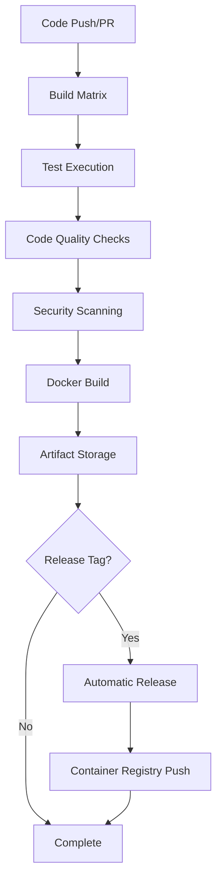

# CI/CD Enhancement Guide

## Overview

This document describes the CI/CD pipeline enhancement for the `unilink` project. Since the project previously had no CI/CD configuration, we have built a comprehensive automation pipeline.

## Implemented CI/CD Components

### 1. GitHub Actions Workflows

#### 1.1 Main CI Pipeline (`.github/workflows/ci.yml`)

**Key Features:**
- **Multi-platform Build**: Ubuntu 20.04/22.04
- **Multi-compiler Support**: GCC, Clang
- **Build Configurations**: Minimal Build, Full Build
- **Automated Testing**: 242 test cases automatically executed
- **Documentation Generation**: API documentation auto-generated with Doxygen
- **Artifact Management**: Build artifacts automatically stored

**Workflow Steps:**
1. **Build and Test Matrix**: Various OS/compiler combinations
2. **Memory Safety Tests**: AddressSanitizer, LeakSanitizer
3. **Performance Tests**: Benchmark and performance validation
4. **Code Quality Checks**: clang-format, cppcheck
5. **Docker Build and Test**: Container environment validation
6. **Security Scanning**: Vulnerability scanning with Trivy
7. **Release Automation**: Tag-based automatic releases

#### 1.2 Docker Workflow (`.github/workflows/docker.yml`)

**Key Features:**
- **Multi-architecture Build**: linux/amd64, linux/arm64
- **Automatic Push**: GitHub Container Registry
- **Cache Optimization**: GitHub Actions cache utilization
- **Security Scanning**: Trivy vulnerability scanning

#### 1.3 CodeQL Security Analysis (`.github/workflows/codeql.yml`)

**Key Features:**
- **Static Analysis**: C++ code security vulnerability scanning
- **Regular Scanning**: Weekly automatic scans
- **PR-based Scanning**: Security checks for all PRs

### 2. Docker Optimization

#### 2.1 Multi-stage Build

**Builder Stage:**
- Includes all build tools
- Test execution
- Documentation generation

**Production Stage:**
- Minimal runtime dependencies only
- Non-root user for security
- Optimized image size

#### 2.2 Docker Compose Configuration

**Development Environment:**
- Real-time code change reflection
- Debug build configuration
- Test environment separation

**Production Environment:**
- Production optimization
- Automatic restart configuration
- Network isolation

### 3. Dependency Management

#### 3.1 Dependabot Configuration

**Automatic Updates:**
- GitHub Actions updates
- Docker image updates
- Weekly automatic PR generation

## CI/CD Pipeline Flow



## Key Improvements

### 1. Enhanced Automation Level

**Before:**
- Manual build and testing
- No CI/CD pipeline
- Manual release process

**After:**
- Fully automated CI/CD pipeline
- Multi-platform automatic testing
- Automatic release and deployment

### 2. Strengthened Quality Assurance

**Test Coverage:**
- 242 test cases automatically executed
- Memory safety tests
- Performance benchmarks
- Multi-platform validation

**Code Quality:**
- Automatic formatting checks
- Static analysis tools
- Security vulnerability scanning

### 3. Enhanced Development Efficiency

**Fast Feedback:**
- Results within 5-10 minutes per PR on average
- Parallel test execution
- Build optimization through caching

**Development Environment:**
- Consistent environment through Docker Compose
- Real-time code change reflection
- Debug and production environment separation

### 4. Security Enhancement

**Vulnerability Management:**
- Container security scanning with Trivy
- Code security analysis with CodeQL
- Automatic dependency updates

**Container Security:**
- Non-root user execution
- Principle of least privilege
- Attack surface minimization through multi-stage builds

## Usage

### 1. Local Development Environment Setup

```bash
# Development environment using Docker Compose
docker-compose up dev

# Run tests
docker-compose up test

# Performance tests
docker-compose up perf

# Documentation server
docker-compose up docs
```

### 2. CI/CD Pipeline Monitoring

1. Check workflow status in **GitHub Actions tab**
2. Review automatic check results in **Pull Request**
3. Check security scan results in **Security tab**

### 3. Release Process

```bash
# Trigger automatic release with tag creation
git tag v1.0.0
git push origin v1.0.0
```

## Monitoring and Notifications

### 1. Workflow Status Notifications

- **On Failure**: Automatic email notifications
- **On Success**: Slack/Teams integration available
- **Security Issues**: Immediate notifications

### 2. Metrics Collection

- **Build Time**: Average build time tracking
- **Test Success Rate**: Test pass rate monitoring
- **Security Scan Results**: Vulnerability trend analysis

## Future Improvement Plans

### 1. Short-term Improvements (1-2 months)

- **Performance Monitoring**: Build time optimization
- **Test Parallelization**: Faster test execution
- **Cache Strategy**: More efficient cache utilization

### 2. Medium-term Improvements (3-6 months)

- **Kubernetes Deployment**: Container orchestration
- **Monitoring Dashboard**: Grafana/Prometheus integration
- **Automatic Rollback**: Automatic recovery on issues

### 3. Long-term Improvements (6+ months)

- **AI-based Code Review**: Automatic code quality improvement
- **Performance Prediction**: Machine learning-based performance prediction
- **Automatic Scaling**: Traffic-based automatic scaling

## Troubleshooting

### 1. Common Issues

**Build Failure:**
```bash
# Reproduce locally
docker-compose up dev
cd build && cmake .. && make
```

**Test Failure:**
```bash
# Run specific test
cd build && ctest -R "MemorySafetyTest"
```

**Docker Build Failure:**
```bash
# Clear Docker cache
docker system prune -a
docker-compose build --no-cache
```

### 2. Performance Optimization

**Build Time Reduction:**
- Utilize parallel builds: `-j $(nproc)`
- Optimize cache strategy
- Remove unnecessary dependencies

**Test Time Reduction:**
- Parallel test execution
- Prioritize fast tests
- Separate slow tests

## Conclusion

The implemented CI/CD pipeline provides the following benefits:

1. **Complete Automation**: Manage entire development lifecycle without manual intervention
2. **High Quality**: Ensure code quality through various tests and checks
3. **Security Enhancement**: Prevent vulnerabilities through multi-layer security checks
4. **Development Efficiency**: Provide fast feedback and consistent development environment
5. **Operational Stability**: Automated deployment and monitoring

These CI/CD enhancements can significantly improve the development team's productivity and code quality.