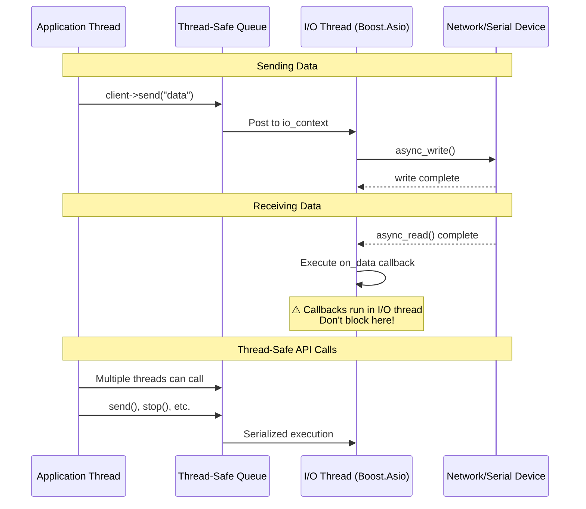
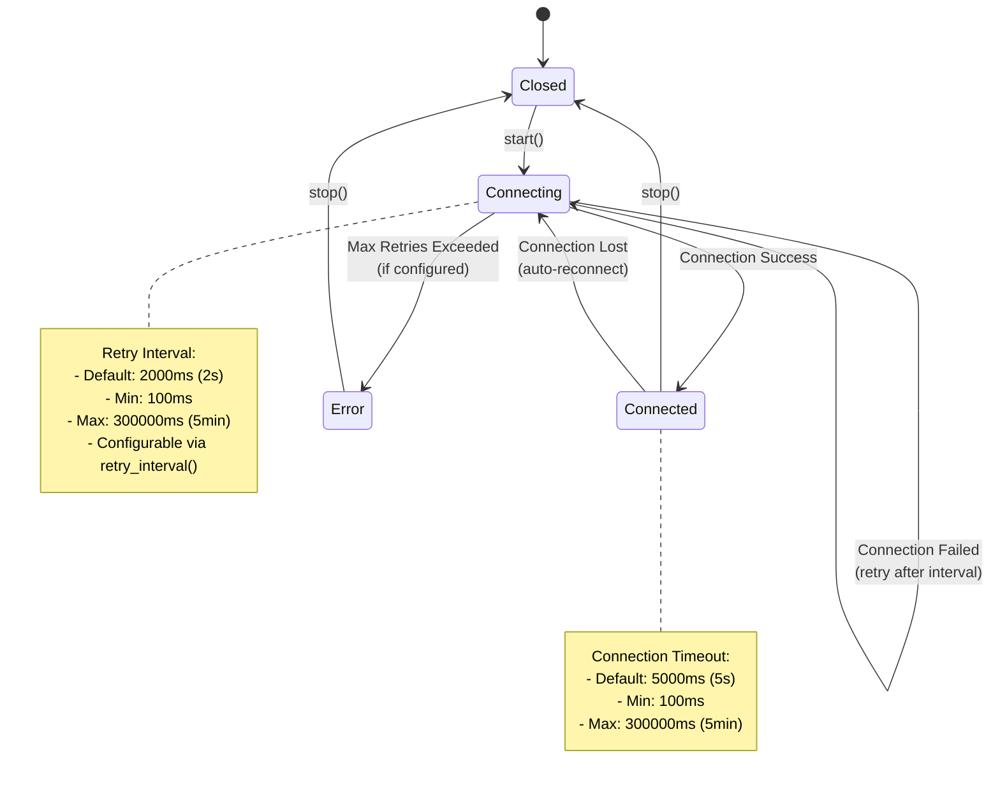
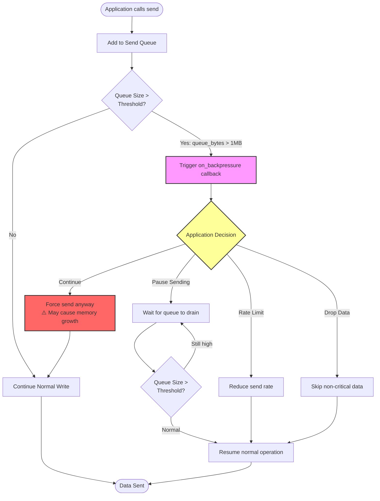

# Runtime Behavior Model

Understanding how `unilink` operates internally helps you write more efficient and robust applications. This document describes the threading model, reconnection policies, and backpressure handling.

---

## Table of Contents

1. [Threading Model & Callback Execution](#threading-model--callback-execution)
2. [Reconnection Policy & State Machine](#reconnection-policy--state-machine)
3. [Backpressure Handling](#backpressure-handling)
4. [Best Practices](#best-practices)

---

## Threading Model & Callback Execution

All I/O operations run in a dedicated I/O thread (Boost.Asio), while user code runs in separate application threads. Callbacks are always executed in the I/O thread context.

### Architecture Diagram



---

### Key Points

#### ✅ Thread-Safe API Methods

All public API methods are thread-safe and can be called from any thread:

```cpp
// Safe to call from multiple threads simultaneously
std::thread t1([&client]() { client->send("data1"); });
std::thread t2([&client]() { client->send("data2"); });
std::thread t3([&client]() { client->stop(); });
```

**Implementation:**
- All API calls are serialized through `boost::asio::post()`
- Operations are queued and executed in the I/O thread
- No manual locking required by users

---

#### ✅ Callback Execution Context

**Important:** Callbacks execute in the I/O thread context:

```cpp
auto client = unilink::tcp_client("server.com", 8080)
    .on_data([](const std::string& data) {
        // ⚠️ This runs in the I/O thread!
        // Don't block here!
        std::cout << "Received: " << data << std::endl;
    })
    .build();
```

**Available callbacks:**
- `on_connect()` - Connection established
- `on_disconnect()` - Connection lost
- `on_data()` - Data received
- `on_error()` - Error occurred
- `on_backpressure()` - Queue size exceeded threshold

---

#### ⚠️ Never Block in Callbacks

**Bad - Blocks I/O thread:**

```cpp
.on_data([](const std::string& data) {
    // ❌ BAD: Blocks I/O thread
    std::this_thread::sleep_for(std::chrono::seconds(1));
    heavy_computation(data);
    database_query(data);  // Blocking I/O
})
```

**Good - Offload to worker threads:**

```cpp
.on_data([](const std::string& data) {
    // ✅ GOOD: Offload to worker thread
    std::thread([data]() {
        heavy_computation(data);
        database_query(data);
    }).detach();
    
    // Or use a thread pool
    thread_pool.submit([data]() {
        heavy_computation(data);
    });
})
```

**Impact of blocking:**
- Blocks all I/O operations
- Prevents other connections from processing data
- Can cause timeouts and dropped connections
- Reduces throughput by 10-100x

---

#### ✅ Thread-Safe State Access

Use `net::post()` to safely access state from application threads:

```cpp
// Application thread wants to access I/O thread state
boost::asio::post(io_context, [&client]() {
    // Now safely in I/O thread context
    bool connected = client->is_connected();
    std::cout << "Connected: " << connected << std::endl;
});
```

---

### Threading Model Summary

| Aspect | Details |
|--------|---------|
| **I/O Thread** | Single dedicated thread running `io_context.run()` |
| **Application Threads** | Any number of threads calling API methods |
| **Callback Thread** | Always I/O thread |
| **Thread Safety** | All API methods thread-safe via `post()` |
| **Synchronization** | Automatic via Boost.Asio |

---

## Reconnection Policy & State Machine

TCP clients and Serial connections automatically handle connection failures with configurable retry logic.

### State Machine Diagram



---

### Connection States

| State | Description | Transitions |
|-------|-------------|-------------|
| **Closed** | Not started or explicitly stopped | → Connecting (on `start()`) |
| **Connecting** | Attempting to establish connection | → Connected (success)<br>→ Connecting (retry)<br>→ Error (max retries) |
| **Connected** | Active connection | → Closed (on `stop()`)<br>→ Connecting (connection lost) |
| **Error** | Unrecoverable error occurred | → Closed (on `stop()`) |

---

### Configuration Example

```cpp
auto client = unilink::tcp_client("server.com", 8080)
    .retry_interval(5000)    // Retry every 5 seconds
    .auto_start(true)         // Start immediately
    .on_connect([]() { 
        std::cout << "Connected!" << std::endl;
    })
    .on_disconnect([]() { 
        std::cout << "Disconnected - will auto-reconnect" << std::endl;
    })
    .build();
```

---

### Retry Behavior

#### Default Behavior

- **Unlimited retries** with 2-second intervals
- Automatically reconnects on connection loss
- No exponential backoff (constant interval)

#### Retry Interval Configuration

```cpp
// Fast reconnection (aggressive)
.retry_interval(100)  // 100 ms

// Moderate reconnection (default)
.retry_interval(2000)  // 2 seconds

// Slow reconnection (conservative)
.retry_interval(10000)  // 10 seconds
```

**Range:** 100 ms - 300,000 ms (5 minutes)

---

#### State Callbacks

Monitor connection state changes:

```cpp
auto client = unilink::tcp_client("server.com", 8080)
    .on_connect([]() {
        // Connection established
        std::cout << "✅ Connected" << std::endl;
    })
    .on_disconnect([]() {
        // Connection lost (will auto-reconnect)
        std::cout << "❌ Disconnected" << std::endl;
    })
    .on_error([](const std::string& error) {
        // Error occurred
        std::cout << "⚠️ Error: " << error << std::endl;
    })
    .build();
```

---

#### Manual Control

Stop automatic reconnection:

```cpp
// Stop and prevent reconnection
client->stop();

// Check connection status (thread-safe)
bool connected = client->is_connected();

// Restart connection
client->start();
```

---

### Reconnection Best Practices

#### 1. Choose Appropriate Retry Interval

| Use Case | Retry Interval | Reason |
|----------|---------------|---------|
| **Local network** | 1-2 seconds | Quick recovery |
| **Internet connection** | 5-10 seconds | Avoid overwhelming server |
| **Mobile/unstable** | 10-30 seconds | Conserve battery, reduce load |
| **Background service** | 30-60 seconds | Minimal resource usage |

---

#### 2. Handle State Transitions

```cpp
std::atomic<bool> is_ready{false};

auto client = unilink::tcp_client("server.com", 8080)
    .on_connect([&is_ready]() {
        is_ready = true;
        // Initialize resources
    })
    .on_disconnect([&is_ready]() {
        is_ready = false;
        // Cleanup or pause operations
    })
    .build();

// Application code checks is_ready before sending
if (is_ready) {
    client->send("data");
}
```

---

#### 3. Graceful Shutdown

```cpp
// Stop reconnection before exiting
client->stop();

// Wait for I/O thread to finish (automatic in destructor)
client.reset();
```

---

## Backpressure Handling

When the send queue grows too large (network slower than application), `unilink` notifies your application via backpressure callbacks.

### Backpressure Flow



---

### Backpressure Configuration

```cpp
auto client = unilink::tcp_client("server.com", 8080)
    .on_backpressure([](size_t queue_bytes) {
        std::cout << "⚠️ Queue size: " << queue_bytes << " bytes" << std::endl;
        
        // Option 1: Pause sending
        // Option 2: Rate limit
        // Option 3: Drop non-critical data
    })
    .build();
```

**Default threshold:** 1 MB (1,048,576 bytes)  
**Configurable range:** 1 KB - 100 MB

---

### Backpressure Strategies

#### Strategy 1: Pause Sending

Stop sending until queue drains:

```cpp
std::atomic<bool> can_send{true};

auto client = unilink::tcp_client("server.com", 8080)
    .on_backpressure([&can_send](size_t queue_bytes) {
        if (queue_bytes > 5 * 1024 * 1024) {  // 5 MB
            can_send = false;
        } else if (queue_bytes < 1024 * 1024) {  // 1 MB
            can_send = true;
        }
    })
    .build();

// Application code
if (can_send) {
    client->send(data);
}
```

**Best for:** Real-time data, can tolerate delays

---

#### Strategy 2: Rate Limiting

Reduce send rate:

```cpp
auto client = unilink::tcp_client("server.com", 8080)
    .on_backpressure([](size_t queue_bytes) {
        // Slow down sending
        std::this_thread::sleep_for(std::chrono::milliseconds(10));
    })
    .build();
```

**Best for:** Continuous data streams

---

#### Strategy 3: Drop Data

Skip non-critical data:

```cpp
std::atomic<bool> high_backpressure{false};

auto client = unilink::tcp_client("server.com", 8080)
    .on_backpressure([&high_backpressure](size_t queue_bytes) {
        high_backpressure = (queue_bytes > 10 * 1024 * 1024);  // 10 MB
    })
    .build();

// Send only critical data when backpressure is high
if (!high_backpressure || is_critical) {
    client->send(data);
}
```

**Best for:** Non-critical telemetry, logging

---

#### Strategy 4: Buffer Expansion (Default)

Continue sending, allow queue to grow:

```cpp
// Default behavior - no backpressure handling
auto client = unilink::tcp_client("server.com", 8080)
    .build();

// Queue will grow until memory exhausted
```

**Best for:** Short bursts, ample memory available  
**Warning:** May cause out-of-memory if sustained

---

### Backpressure Monitoring

Track queue size continuously:

```cpp
size_t max_queue_size = 0;

auto client = unilink::tcp_client("server.com", 8080)
    .on_backpressure([&max_queue_size](size_t queue_bytes) {
        max_queue_size = std::max(max_queue_size, queue_bytes);
        std::cout << "Current queue: " << queue_bytes 
                  << " bytes, Max: " << max_queue_size << " bytes\n";
    })
    .build();
```

---

### Memory Safety

Backpressure handling ensures:

- ✅ Queue size is monitored continuously
- ✅ Callback fires when `queue_bytes > threshold`
- ✅ Application can take corrective action
- ⚠️ **No automatic flow control** - application must handle backpressure
- ✅ Memory pools reduce allocation overhead for small buffers (<64KB)

---

## Best Practices

### 1. Threading Best Practices

#### ✅ DO
- Keep callbacks short and non-blocking
- Offload heavy work to worker threads
- Use thread pools for parallel processing
- Check connection state before sending

#### ❌ DON'T
- Block in callbacks
- Call `sleep()` in callbacks
- Perform database queries in callbacks
- Do heavy computation in callbacks

---

### 2. Reconnection Best Practices

#### ✅ DO
- Set appropriate retry intervals for your use case
- Handle state transitions (connect/disconnect)
- Implement graceful shutdown
- Monitor connection status

#### ❌ DON'T
- Set extremely short retry intervals (<100ms)
- Ignore disconnect callbacks
- Assume connection is always available
- Forget to call `stop()` before cleanup

---

### 3. Backpressure Best Practices

#### ✅ DO
- Monitor backpressure in production
- Implement appropriate handling strategy
- Test with slow networks
- Set reasonable thresholds

#### ❌ DON'T
- Ignore backpressure callbacks
- Assume unlimited memory
- Send without rate limiting
- Forget to handle high-load scenarios

---

## Performance Considerations

### Threading Overhead

- **Callback invocation:** ~1-5 μs overhead
- **Thread-safe API calls:** ~2-10 μs overhead (post to I/O thread)
- **Context switching:** Minimize by batching operations

### Reconnection Overhead

- **TCP connection establishment:** ~10-100 ms
- **Retry timer:** ~0.1 ms overhead per retry
- **Recommendation:** Reuse connections when possible

### Backpressure Overhead

- **Queue monitoring:** Negligible (<0.1% CPU)
- **Callback invocation:** Only when threshold exceeded
- **Memory pools:** ~30% faster for small buffers

---

## Next Steps

- [Memory Safety](memory_safety.md) - Memory safety features
- [System Overview](system_overview.md) - High-level architecture
- [Performance Guide](../guides/performance.md) - Optimization techniques
- [Best Practices](../guides/best_practices.md) - Recommended patterns

