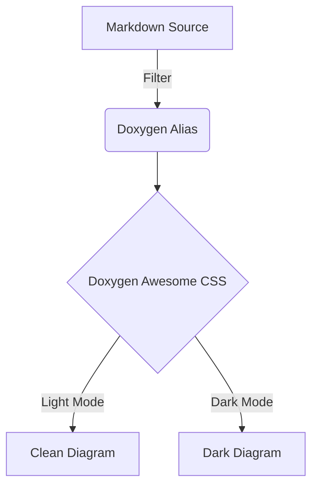
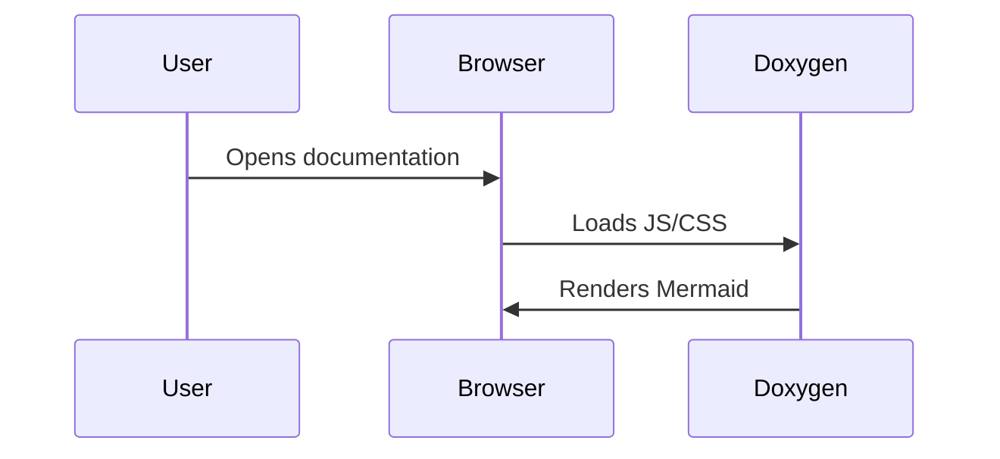

# Mermaid Test Page

This page tests the automatic conversion of Markdown Mermaid blocks into Doxygen-compatible diagrams.

## Flowchart Test

```mermaid
graph TD
    A[Markdown Source] -->|Filter| B(Doxygen Alias)
    B --> C{Doxygen Awesome CSS}
    C -->|Light Mode| D[Clean Diagram]
    C -->|Dark Mode| E[Dark Diagram]
```

## Sequence Diagram Test

```mermaid
sequenceDiagram
    participant User
    participant Browser
    participant Doxygen
    User->>Browser: Opens documentation
    Browser->>Doxygen: Loads JS/CSS
    Doxygen->>Browser: Renders Mermaid
```
